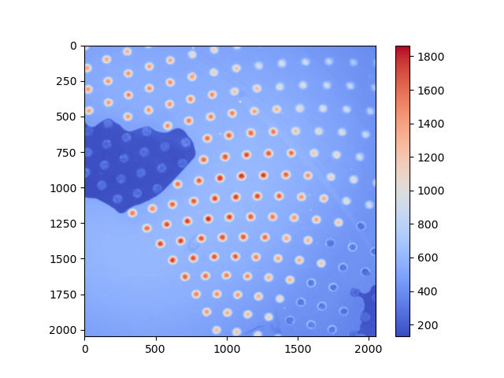

# image_processing
Process tif files taken with a fluorescence microscope to create png and gif files.
1. Adjust the brightness
2. Add color to make it easier to see
3. Create a gif file from multiple photos

## DEMO
|**Input**|**Output**|||
|:---:|:---:|:---:|:---:|
|**tif**|**color_png**|**monochrome_png**|**sliding_gif**|
|||||
